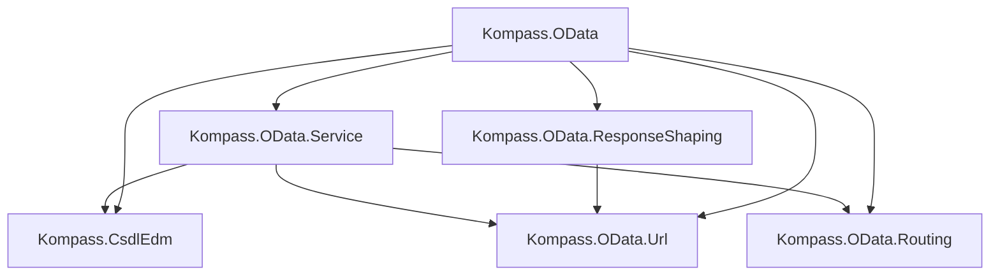

# Architecture

This document describes the design principles and internal structure of Kompass.OData.
It is aimed at contributors and anyone who wants to understand how the pieces fit together.

## Design Principles

### Schema First

The entire service surface is derived from a CSDL schema.
Handlers are registered against **EDM constructs** (entity set names, navigation property names) rather than URL patterns.
At build time the framework validates every registration against the resolved model—an unknown entity set or a navigation property without `ContainsTarget=true` is a configuration error, not a runtime surprise.
`GetWarnings()` reports entity sets and contained navigations that have no handlers, so gaps in coverage are visible before the first request arrives.

### Syntactic CSDL Tree vs. Semantic EDM Model

The library separates parsing from resolution into two distinct layers.

| Layer | Namespace | References | Purpose |
| --- | --- | --- | --- |
| Syntactic | `Csdl.*` | Strings (`"BuildingManagement.Room"`) | Faithful in-memory image of the XML/JSON document |
| Semantic | `Edm.*` | Direct object pointers (`EntityType` reference) | Fully resolved model ready for consumption |

The **syntactic tree** is produced by `CsdlXmlReader` or `CsdlJsonReader`.
Both readers produce the same `CsdlDocument` regardless of format—XML and JSON are interchangeable inputs.

The **semantic model** is produced by the `Resolver` via two passes:

1. **Registration** — walk all schemas and create empty EDM shells for every named element (entity types, complex types, enum types, containers, etc.), inserting them into lookup dictionaries.
2. **Resolution** — revisit every element and convert string references to object pointers: base types, property types, navigation targets, partner paths, key property chains, and navigation property bindings on entity sets.

Because C# has garbage collection, resolved references are plain object fields—no `Arc<T>` / `Weak<T>` indirection needed.
After resolution the `Validator` runs semantic checks (key-property constraints, containment rules, etc.).

### Typed Handler Contexts

Handler context types mirror the four URL shapes an OData endpoint can have:

```
ODataContext (abstract base)
├── CollectionContext            — entity-set collection
├── EntityContext                — single entity by key
├── ContainedCollectionContext   — contained collection behind a parent key
└── ContainedEntityContext       — single contained entity
```

The shared base carries the entity-set name, request body stream, context URL, and a **lazily parsed** `QueryOptions` (the raw query string is stored; parsing happens on first `.Query` access).
Each subtype adds only the fields its shape implies—`Key`, `ParentKey`, `NavProp`—so handlers never inspect fields that don't apply.

### Generic State (`TState`)

`ODataServiceBuilder<TState>` is generic over the state type injected into every handler, similar to Axum's `Router::with_state`.
The convenience factory `ODataServiceBuilder.FromCsdl(csdl)` defaults `TState` to `IServiceProvider` (always resolvable from ASP.NET Core DI); `FromCsdl<TState>(csdl)` lets you choose your own.
State is resolved per request via `services.GetRequiredService<TState>()`.

## Assembly Map

Each assembly corresponds to a single responsibility.
Arrows show compile-time dependencies.



| Assembly | Responsibility |
| --- | --- |
| **Kompass.CsdlEdm** | CSDL XML/JSON reader, syntactic model (`Csdl.*`), two-pass resolver, semantic EDM model (`Edm.*`), validator. No HTTP, no async. |
| **Kompass.OData.Url** | OData URL and query-string parser → `ODataQuery` / `QueryOptions`. Covers `$filter`, `$select`, `$expand`, `$orderby`, `$top`/`$skip`, `$count`. No HTTP, no schema dependency. |
| **Kompass.OData.Routing** | ASP.NET middleware that rewrites OData parenthesized-key URLs (`/Rooms('oak-204')`) into segment form (`/Rooms/__key__/oak-204`) for standard routing. Stashes the original URI as `OriginalODataUri`. |
| **Kompass.OData.Service** | Service builder, handler context types, endpoint registration driven by EDM constructs. Maps to ASP.NET Minimal API endpoints with dual-route registration (segment-style + rewrite-style). |
| **Kompass.OData.ResponseShaping** | OData-aware JSON envelope construction (`{"value":[...]}`), `$select` projection, and system annotations (`@odata.context`, `@odata.count`, `@odata.nextLink`). |
| **Kompass.OData** | Umbrella meta-package referencing all sub-assemblies. |

## Key Internal Types

### Kompass.CsdlEdm

| Type | Role |
| --- | --- |
| `Csdl.CsdlDocument` | Root of the syntactic tree (`Edmx` → `Schema` → elements) |
| `Csdl.EntityType` | Syntactic entity type — `BaseType` is a `string?` |
| `Edm.EntityType` | Resolved entity type — `BaseType` is an `EntityType?` object reference |
| `Edm.NavigationProperty` | Holds a `Target` (`EntityType` reference), `Partner` (resolved path), `ContainsTarget` |
| `Edm.ResolvedType` | Discriminated result of type resolution: Primitive, Enum, Complex, or TypeDefinition |
| `Edm.PrimitiveType` | Enum of OData primitive types (`Edm.String`, `Edm.Int32`, etc.) |
| `Resolver` | Two-pass string-to-object resolution |
| `Validator` | Post-resolution semantic checks |

### Kompass.OData.Service

| Type | Role |
| --- | --- |
| `ODataServiceBuilder` | Static factory (`FromCsdl`, `FromCsdl<TState>`) |
| `ODataServiceBuilder<TState>` | Generic builder — registers handlers by entity set / contained nav, validates, maps endpoints |
| `EntitySetConfig<TState>` | Fluent config for one entity set (`OnList`, `OnGet`, `OnCreate`, `OnDelete`, `ContainedCollection`, `ContainedEntity`) |
| `SchemaView` | Internal projection of the EDM model into a router-oriented working set |

## Route Registration

`MapODataEndpoints` registers **two routes per endpoint**—one using the `__key__` sentinel produced by the rewrite middleware, one using standard key-as-segment style:

```
GET /Rooms/__key__/{id}     ← rewrite-style (from ODataPathRewriteMiddleware)
GET /Rooms/{id}             ← segment-style (direct)
```

Both resolve to the same handler.
`app.GetODataRoutes()` / `app.PrintODataRoutes()` query the ASP.NET `EndpointDataSource`, filter out sentinels, and deduplicate for a clean route listing.

## Filter Expression AST

The `$filter` parser produces a recursive AST:

```
FilterExpression
├── Literal (null, bool, number, string)
├── Member (property path)
├── FunctionCall (name + args)
├── Unary (not, negate)
└── Binary (eq, ne, gt, ge, lt, le, and, or, add, sub, mul, div, mod)
```

`ToString()` round-trips with correct operator precedence and parenthesization.
Span tracking preserves source positions for error reporting.
